# Оліярник Сергій ІПЗ-2.1
Хід роботи

 * Використання готових Docker Images.

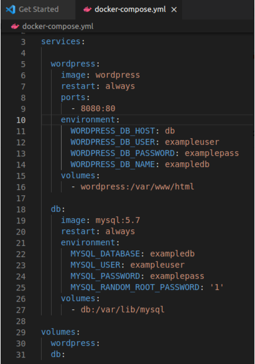
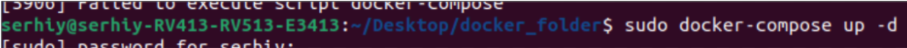
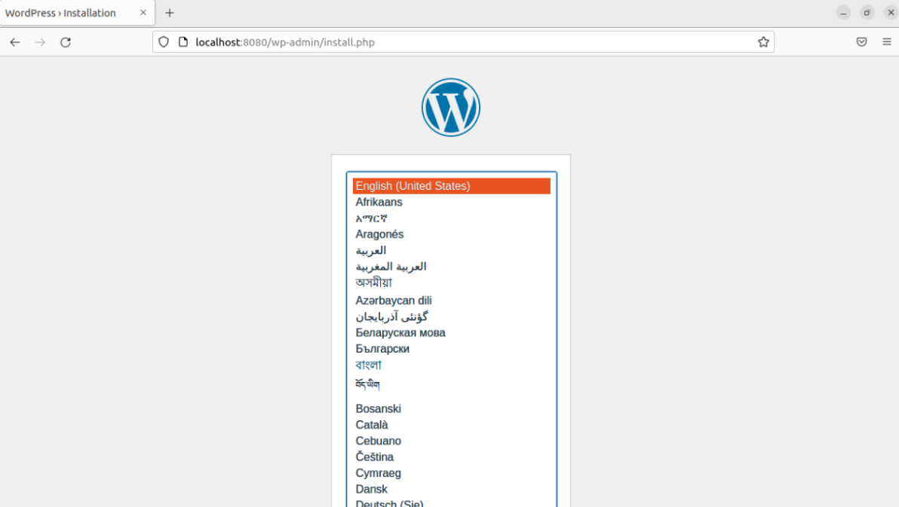
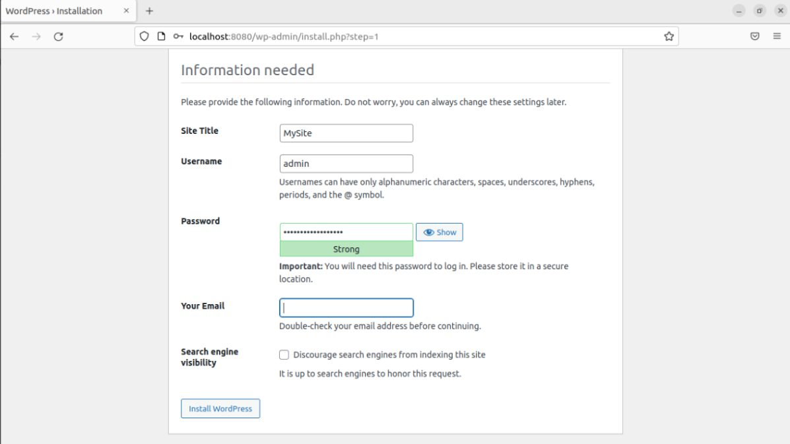
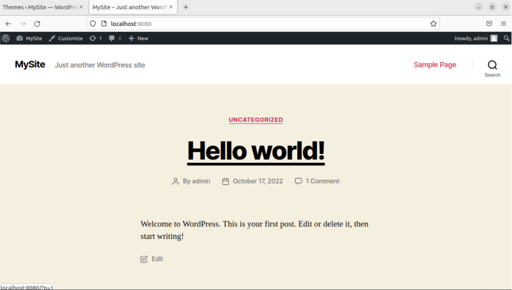

 * Використання Docker Compose.
 
Docker використовується для керування окремими контейнерами (сервісами), з яких складається програма.

Docker Compose використовується для одночасного керування кількома контейнерами, що входять до складу програми. Цей інструмент пропонує ті ж можливості, що й Docker, але дозволяє працювати з більш складними програмами.

Якщо ж ви використовуєте Docker Compose, то перенесення вашого проекту на новий сервер - це питання, яке вирішується виконанням кількох команд. Для того, щоб завершити перенесення проекту на нове місце, вам потрібно лише виконати деякі налаштування та завантажити на новий сервер резервну копію бази даних.
 * Створення HTML сторінки та занесення її в Docker Image. Залити даний Docker Image на Docker Hub.
 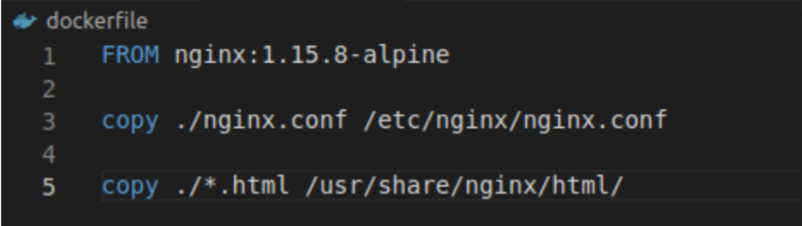
 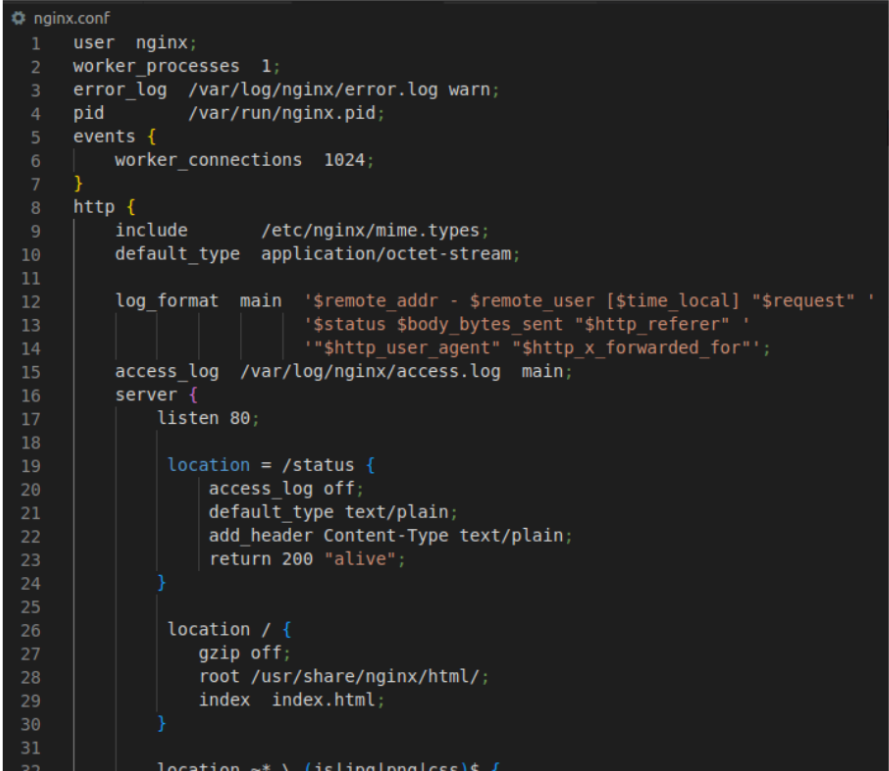
 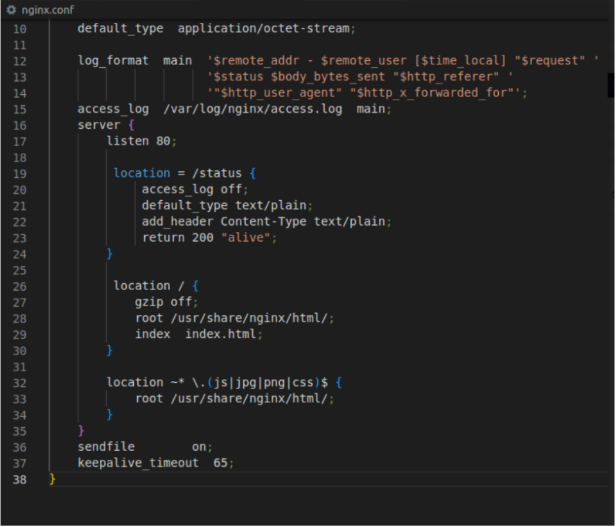
 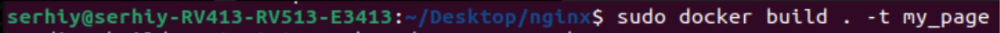
 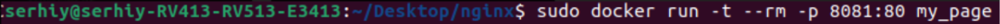
 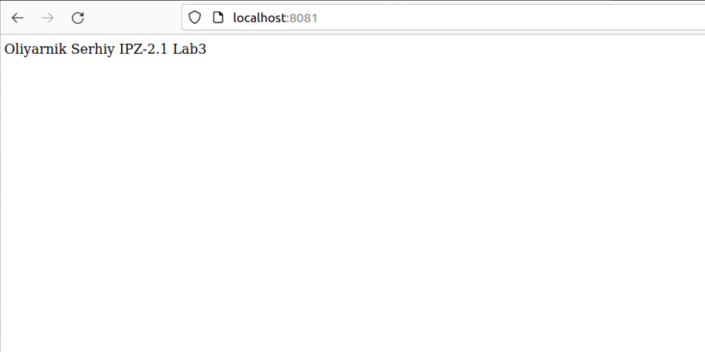
 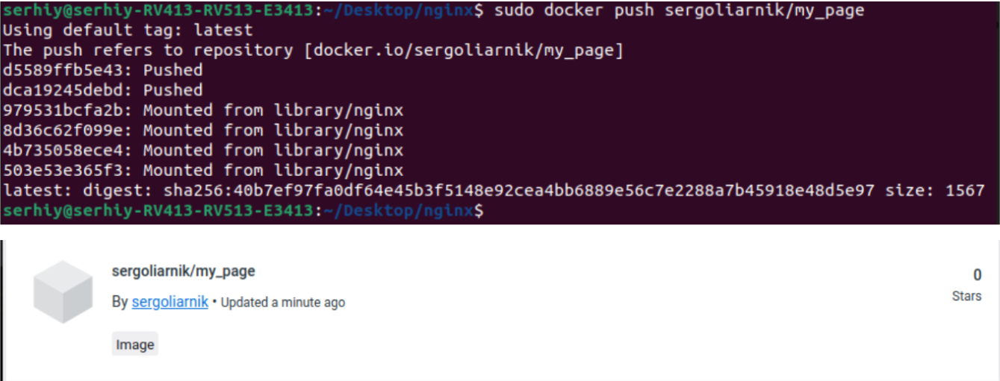
 
 * Скачати Docker Image когось із групи і розвернути в себе контейнер з HTML сторінкою на порті 8086 ззовні.
 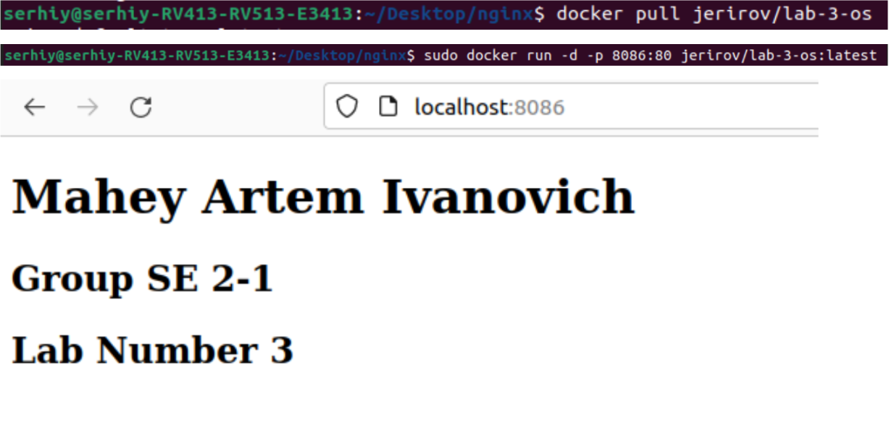
 
Висновок: на даній лабораторній роботі я зміг попрацювати з докером, розвернути вордпрес, створити свій image.
