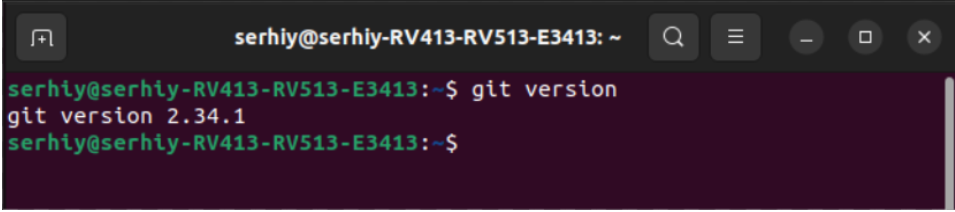
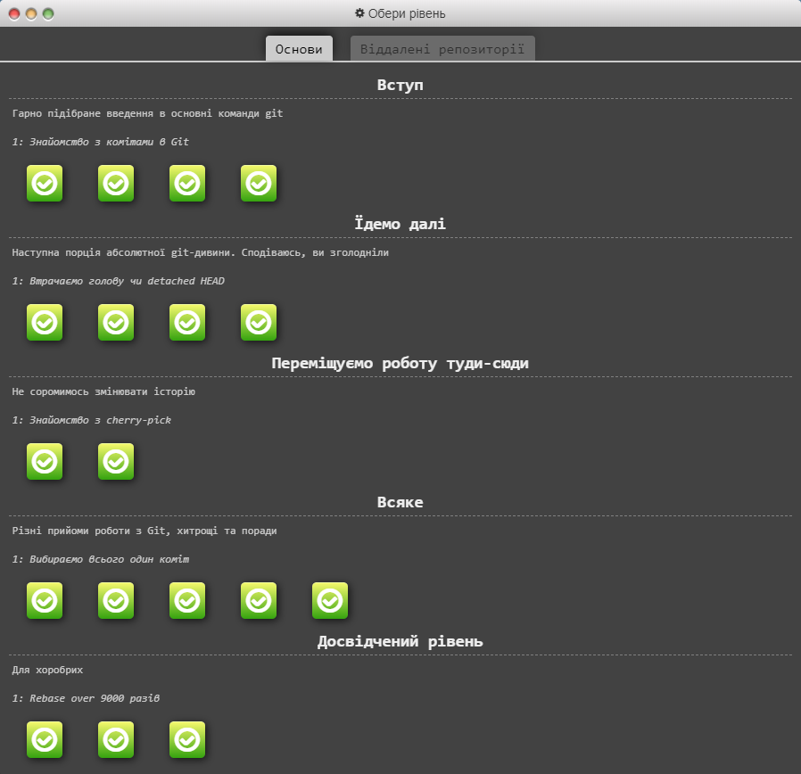
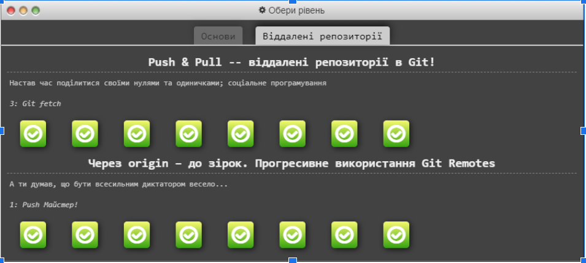
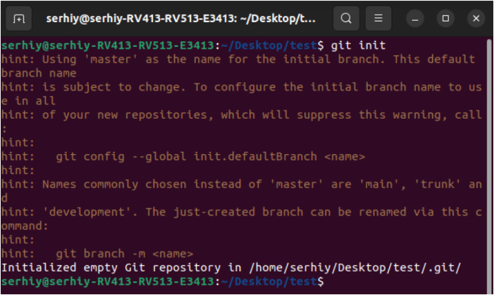
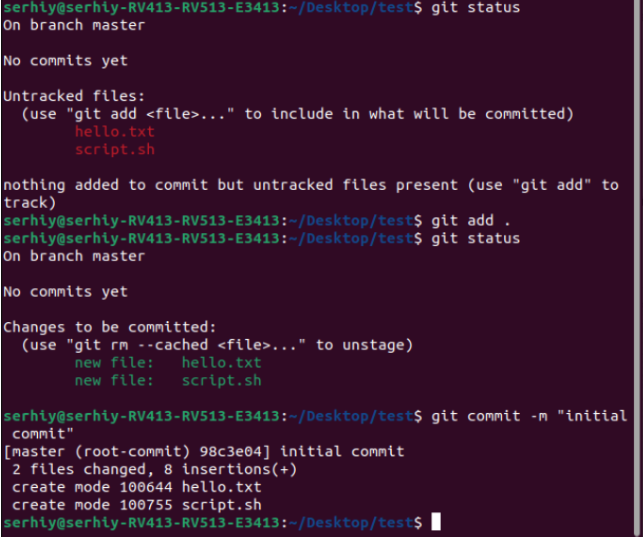
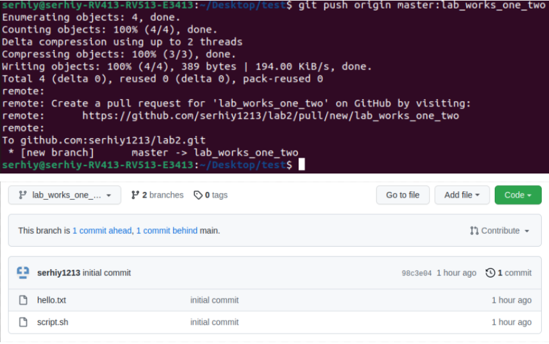
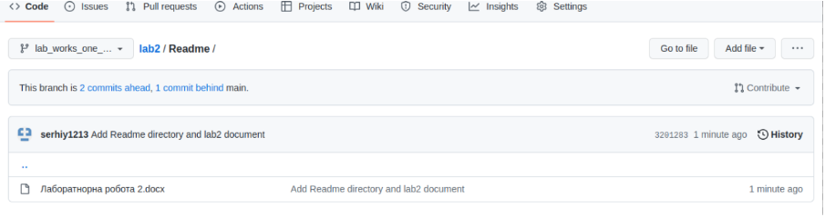

# Оліярник Сергій ІПЗ-2.1
Хід роботи

 * Пройти гру Git Learn та зробити скріншоти пройдених рівнів.

Перш за все до чого я приступив, це була установка git. Для цього я прописав команду sudo apt install git.
Щоб впевнитись що все добре я прописав команду git version

 * Зробити git init папки із файлом  hello.txt та bash скриптом.

Спочатку я створив нову папку завдяки команді mkdir test та переніс туди необхідні файли. Потім я зробив git init цієї папки

 * Зробити git commit.
Мої два файли не були поки додані до гіт, завдяки команді git status я міг в цьому запевнитися. Після того як виконав команду ‘git add . ’ (відразу додає всі файли)я прописав команду git commit -m “initial commit”

 * Зробити git push у віддалений репозиторій у вітку lab_works_one_two.

 * Додати в папку Readme файл із звітом до лабораторної, щоб його можна було передивлятись на репозиторію коли переходиш у вітку.

Висновок: на даній лабораторній роботі я зміг на практиці попрацювати з гітом. Проходячи гру я дізнався суть контроля версії та різні команди, які можуть знадобитися в ході розробки.
